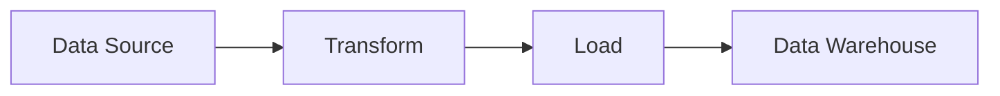

# Data Structures & Algorithms Visualizations

## 📊 For Data Engineering Learning

This directory contains comprehensive visualizations and learning materials focused on Data Engineering applications.

## 🎯 Purpose

As a **Data Engineer**, understanding these concepts helps you:
- Build efficient ETL pipelines
- Process large-scale data
- Optimize data transformations
- Design scalable data systems
- Debug performance issues
- Make architectural decisions

## 📁 Contents

### Interactive Visualizations
- **ASCII Art Diagrams** - Terminal-friendly visualizations
- **Mermaid Diagrams** - GitHub-rendered flowcharts
- **Step-by-step Execution** - See how algorithms work
- **Performance Graphs** - Compare implementations

### Learning Materials
- **Beginner Tutorials** - Start from scratch
- **Data Engineering Use Cases** - Real-world scenarios
- **Language Comparisons** - When to use which
- **Best Practices** - Industry standards

## 🗂️ Structure

```
visualizations/
├── README.md                          # This file
├── data_structures/
│   ├── linked_list_visual.md         # Linked list visualizations
│   ├── stack_queue_visual.md         # Stack & Queue (future)
│   └── tree_graph_visual.md          # Trees & Graphs (future)
├── algorithms/
│   ├── fibonacci_visual.md           # Fibonacci visualizations
│   ├── sorting_visual.md             # Sorting algorithms (future)
│   └── searching_visual.md           # Searching algorithms (future)
├── comparisons/
│   ├── language_comparison.md        # Java vs Scala vs Python
│   └── performance_comparison.md     # Speed & memory comparisons
├── use_cases/
│   ├── data_engineering_scenarios.md # Real DE scenarios
│   ├── etl_pipelines.md              # ETL use cases
│   └── streaming_processing.md       # Stream processing
└── utils/
    ├── visualizer.py                 # Python visualization tool
    └── ascii_art.py                  # ASCII art generator
```

## 🚀 Quick Start

### View Visualizations

All visualizations are in Markdown format and render automatically on GitHub!

1. **Browse the directories** above
2. **Click on any `.md` file**
3. **See diagrams render** in your browser

### Run Interactive Visualizations

```bash
# Install optional dependencies
pip install matplotlib graphviz colorama

# Run visualizers
python visualizations/utils/visualizer.py --demo linked-list
python visualizations/utils/visualizer.py --demo fibonacci
```

## 📚 Learning Path for Beginners

### Week 1: Fundamentals
1. Start with [Linked List Visualization](data_structures/linked_list_visual.md)
2. Understand basic operations (insert, delete, search)
3. Try implementing in Python first (easiest)
4. See [Data Engineering Use Case: Log Processing](use_cases/data_engineering_scenarios.md#log-processing)

### Week 2: Algorithms
1. Study [Fibonacci Visualization](algorithms/fibonacci_visual.md)
2. Learn about dynamic programming
3. Compare different approaches
4. Apply to [Data Engineering: Time Series Analysis](use_cases/data_engineering_scenarios.md#time-series)

### Week 3: Language Comparison
1. Read [Language Comparison Guide](comparisons/language_comparison.md)
2. Implement same problem in all 3 languages
3. Understand trade-offs
4. Choose the right tool for the job

### Week 4: Real Projects
1. Build an [ETL Pipeline](use_cases/etl_pipelines.md)
2. Process streaming data
3. Optimize performance
4. Monitor and debug

## 🎓 Data Engineering Context

### Why These Data Structures Matter

#### Linked Lists
- **Use Case**: Processing streaming data
- **Example**: Apache Kafka consumer buffers
- **Why**: Efficient insertions/deletions in data streams

#### Hash Maps (Two Sum)
- **Use Case**: Data deduplication
- **Example**: Finding duplicate records in datasets
- **Why**: O(1) lookup for large datasets

#### Stacks (Valid Parentheses)
- **Use Case**: Parsing JSON/XML in data pipelines
- **Example**: Validating nested data structures
- **Why**: Track hierarchy and nesting

#### Dynamic Programming (Fibonacci)
- **Use Case**: Caching expensive computations
- **Example**: Memoizing data transformations
- **Why**: Avoid recomputing in DAG workflows

## 🔧 Tools Used

### Python Visualizations
```python
# ASCII art for terminal
from visualizations.utils.ascii_art import LinkedListVisualizer

viz = LinkedListVisualizer()
viz.add(10).add(20).add(30)
viz.display()
# Output: [10] -> [20] -> [30] -> NULL
```

### Mermaid Diagrams


## 📊 Example: Linked List in Data Engineering

### Scenario: Processing Click Stream Data

```
User Clicks (Stream)
        ↓
   Linked List Buffer
        ↓
  [Click1] → [Click2] → [Click3] → NULL
        ↓
   Batch Processing
        ↓
   Write to Database
```

### Why Linked List?
- ✅ Efficient insertions (O(1) at head)
- ✅ No fixed size needed
- ✅ Easy to implement sliding windows
- ✅ Memory-efficient for sparse data

### Code Example
```python
class ClickStreamBuffer:
    def __init__(self):
        self.buffer = SinglyLinkedList()

    def add_click(self, click_data):
        self.buffer.insert(click_data)

    def flush_to_db(self):
        for click in self.buffer:
            database.insert(click)
        self.buffer.clear()
```

## 🎯 Interactive Features

### 1. Step-by-Step Execution
Watch algorithms execute step by step:
```bash
python visualizations/utils/visualizer.py --algo fibonacci --steps 10
```

### 2. Performance Comparison
Compare implementations:
```bash
python visualizations/utils/visualizer.py --compare languages
```

### 3. Memory Usage
Visualize memory patterns:
```bash
python visualizations/utils/visualizer.py --memory linked-list
```

## 🌟 Coming Soon

- [ ] Interactive web visualizations
- [ ] Animated GIFs for algorithms
- [ ] Video tutorials
- [ ] Jupyter notebooks with visualizations
- [ ] VS Code extension for live visualization
- [ ] More data structures (Trees, Graphs, Heaps)
- [ ] More algorithms (Sorting, Searching, Graph algorithms)
- [ ] Real DE project templates

## 🤝 Contributing

Want to add visualizations?
1. Follow the existing format
2. Use Mermaid for diagrams
3. Include ASCII art alternatives
4. Add Data Engineering context
5. Provide code examples

## 📖 Resources

- [Mermaid Diagram Syntax](https://mermaid-js.github.io/)
- [Data Engineering Fundamentals](https://www.dataengineering.wiki/)
- [Big O Cheat Sheet](https://www.bigocheatsheet.com/)
- [LeetCode Patterns](https://seanprashad.com/leetcode-patterns/)

---

**Happy Learning! 🚀 Master DSA for Data Engineering!**
