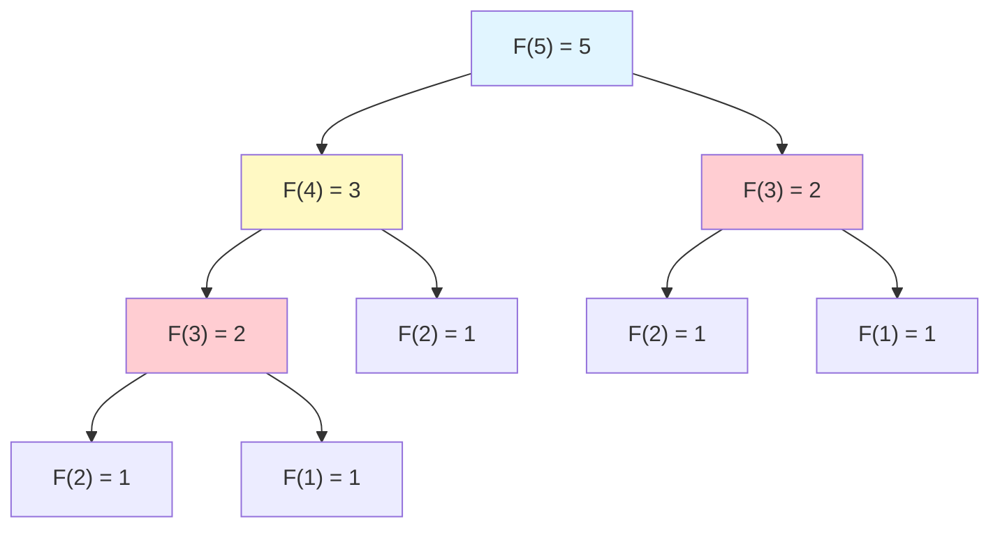
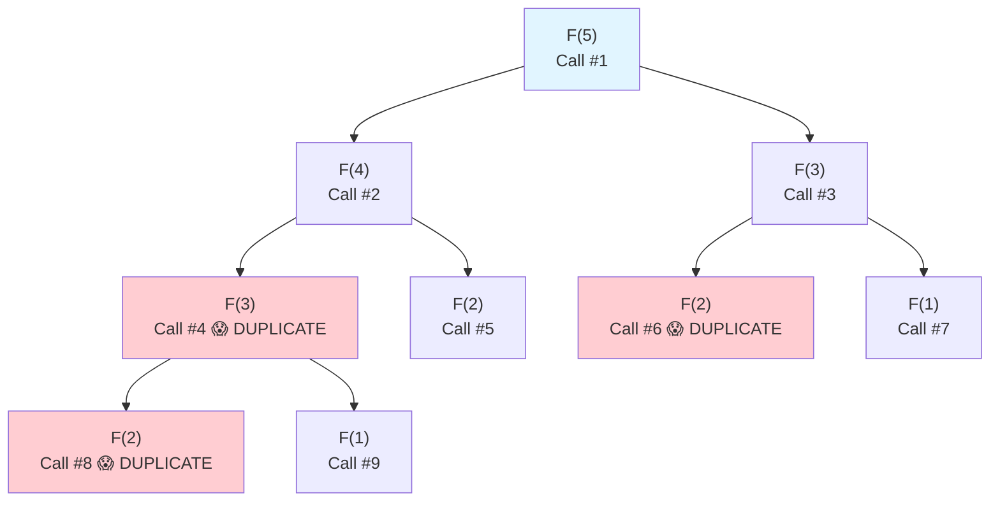
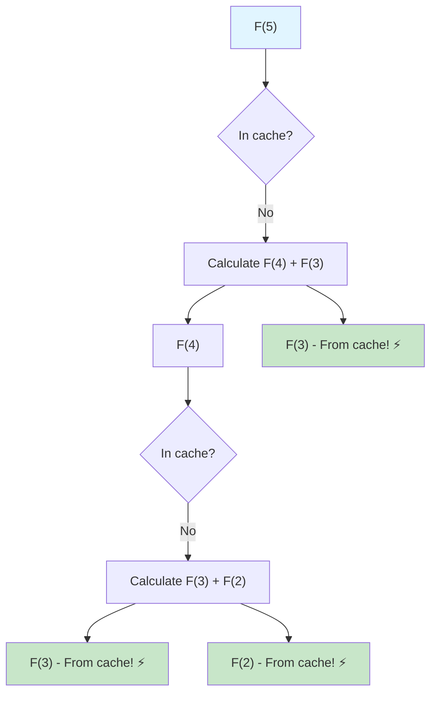
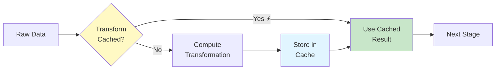

# 🔢 Fibonacci & Dynamic Programming - Visual Guide

## 📖 Table of Contents
1. [What is Dynamic Programming?](#what-is-dynamic-programming)
2. [Fibonacci Sequence Explained](#fibonacci-sequence-explained)
3. [Visual Execution](#visual-execution)
4. [Memoization Visualized](#memoization-visualized)
5. [Data Engineering Use Cases](#data-engineering-use-cases)
6. [Language Comparisons](#language-comparisons)
7. [Performance Analysis](#performance-analysis)

---

## What is Dynamic Programming?

**Dynamic Programming (DP)** is an optimization technique that solves complex problems by:
1. Breaking them into simpler subproblems
2. Storing results of subproblems (memoization)
3. Reusing stored results to avoid redundant calculations

### Key Concept
```
Without DP:  Calculate same value many times ❌
With DP:     Calculate once, reuse result ✅
```

---

## Fibonacci Sequence Explained

### The Sequence
```
0, 1, 1, 2, 3, 5, 8, 13, 21, 34, 55, 89, 144...
```

### The Rule
```
F(0) = 0
F(1) = 1
F(n) = F(n-1) + F(n-2)  for n ≥ 2
```

### Visual Pattern
```
Position:  0   1   2   3   4   5   6   7   8   9   10
Value:     0   1   1   2   3   5   8  13  21  34   55
           │   │   │   │   │   │   │
           └───┴───┘   │   │   │   │
               │       │   │   │   │
           0 + 1 = 1   │   │   │   │
                   └───┴───┘   │   │
                       │       │   │
                   1 + 1 = 2   │   │
                           └───┴───┘
                               │
                           2 + 3 = 5
```

### Mermaid Diagram


**Notice:** F(3) is calculated TWICE! F(2) is calculated THREE times!

This is why we need **memoization**.

---

## Visual Execution

### Approach 1: Naive Recursion (WITHOUT Memoization) ❌

**Computing F(5):**

```
                    F(5)
                   /    \
                F(4)    F(3)
               /   \    /   \
            F(3)  F(2) F(2) F(1)
            / \    / \  / \
         F(2) F(1) F(1) F(0) F(1) F(0)
         / \
     F(1) F(0)
```

**Total Function Calls:** 15 calls for F(5)!

**Call Tree:**


**Time Complexity:** O(2ⁿ) - Exponential! 💥

---

### Approach 2: With Memoization (Dynamic Programming) ✅

**Memoization Cache:**
```
┌─────┬─────┬─────┬─────┬─────┬─────┐
│ n   │  0  │  1  │  2  │  3  │  4  │  5  │
├─────┼─────┼─────┼─────┼─────┼─────┤
│ F(n)│  0  │  1  │  1  │  2  │  3  │  5  │
└─────┴─────┴─────┴─────┴─────┴─────┘
     Memoization Table (Cache)
```

**Step-by-Step Execution for F(5):**

```
Step 1: F(5) - Not in cache, calculate
  └─> Need F(4) and F(3)

Step 2: F(4) - Not in cache, calculate
  └─> Need F(3) and F(2)

Step 3: F(3) - Not in cache, calculate
  └─> Need F(2) and F(1)

Step 4: F(2) - Not in cache, calculate
  └─> Need F(1) and F(0)

Step 5: F(1) - Base case, return 1
  └─> CACHE[1] = 1 ✓

Step 6: F(0) - Base case, return 0
  └─> CACHE[0] = 0 ✓

Step 7: F(2) = F(1) + F(0) = 1 + 0 = 1
  └─> CACHE[2] = 1 ✓

Step 8: F(3) = F(2) + F(1) = 1 + 1 = 2
  └─> CACHE[3] = 2 ✓ (Found in cache!)

Step 9: F(4) = F(3) + F(2) = 2 + 1 = 3
  └─> CACHE[4] = 3 ✓ (Both found in cache!)

Step 10: F(5) = F(4) + F(3) = 3 + 2 = 5
  └─> CACHE[5] = 5 ✓ (Both found in cache!)
```

**Total Function Calls:** Only 6 unique calls! (vs 15 without memoization)

**Call Flow:**


**Time Complexity:** O(n) - Linear! ⚡

---

## Memoization Visualized

### Cache Evolution

**Computing F(7):**

```
Initial Cache:
┌───┬───┐
│ 0 │ 1 │
└───┴───┘

After F(2):
┌───┬───┬───┐
│ 0 │ 1 │ 1 │
└───┴───┴───┘

After F(3):
┌───┬───┬───┬───┐
│ 0 │ 1 │ 1 │ 2 │
└───┴───┴───┴───┘

After F(4):
┌───┬───┬───┬───┬───┐
│ 0 │ 1 │ 1 │ 2 │ 3 │
└───┴───┴───┴───┴───┘

After F(5):
┌───┬───┬───┬───┬───┬───┐
│ 0 │ 1 │ 1 │ 2 │ 3 │ 5 │
└───┴───┴───┴───┴───┴───┘

After F(6):
┌───┬───┬───┬───┬───┬───┬───┐
│ 0 │ 1 │ 1 │ 2 │ 3 │ 5 │ 8 │
└───┴───┴───┴───┴───┴───┴───┘

After F(7):
┌───┬───┬───┬───┬───┬───┬───┬────┐
│ 0 │ 1 │ 1 │ 2 │ 3 │ 5 │ 8 │ 13 │
└───┴───┴───┴───┴───┴───┴───┴────┘
```

### Cache Hit vs Miss

```
Request F(5):
  ┌──────────┐
  │ Check    │
  │ Cache    │
  └────┬─────┘
       │
       ├─────── HIT! ⚡ Return immediately
       │
       └─────── MISS ❌ Calculate & store
```

---

## Data Engineering Use Cases

### 🎯 Use Case 1: Caching Expensive Data Transformations

**Scenario:** ETL pipeline with expensive transformations.



**Implementation:**
```python
from functools import lru_cache
import pandas as pd

class DataPipeline:
    """ETL pipeline with memoization."""

    @lru_cache(maxsize=128)
    def expensive_aggregation(self, date, category):
        """
        Expensive aggregation that we want to cache.

        Similar to Fibonacci: avoid recomputing same inputs.
        """
        print(f"💰 Computing aggregation for {date}, {category}")

        # Expensive operation (e.g., complex SQL query)
        query = f"""
            SELECT category, SUM(sales) as total
            FROM transactions
            WHERE date = '{date}'
            AND category = '{category}'
            GROUP BY category
        """
        result = db.execute(query)
        return result

    def process_report(self, dates, categories):
        """
        Generate report for multiple date/category combinations.

        Many requests will have overlapping dates/categories,
        so memoization saves computation.
        """
        results = []
        for date in dates:
            for category in categories:
                # This will hit cache for duplicate (date, category) pairs!
                data = self.expensive_aggregation(date, category)
                results.append(data)
        return results

# Example usage
pipeline = DataPipeline()

# These dates/categories have overlaps
dates = ['2024-01-01', '2024-01-01', '2024-01-02']  # '2024-01-01' repeats!
categories = ['Electronics', 'Books', 'Electronics']  # 'Electronics' repeats!

# First call: Cache miss - computes
pipeline.expensive_aggregation('2024-01-01', 'Electronics')
# Output: 💰 Computing aggregation for 2024-01-01, Electronics

# Second call: Cache hit! - returns immediately ⚡
pipeline.expensive_aggregation('2024-01-01', 'Electronics')
# Output: (nothing - used cache!)

# Benefit: 3x faster for duplicate requests!
```

**Memoization Stats:**
```
Without Memoization:  9 queries  (3 dates × 3 categories)
With Memoization:     6 queries  (only unique combinations)
Savings:              33% reduction! ⚡
```

---

### 🎯 Use Case 2: DAG Workflow Optimization

**Scenario:** Apache Airflow DAG with dependent tasks.

```
Task Dependency Graph (DAG):

         TaskA
        /     \
    TaskB     TaskC
        \     /
         TaskD

Without Memoization:
- TaskA runs once
- TaskB computes (uses TaskA output)
- TaskC computes (uses TaskA output)
- TaskD computes (recomputes parts of TaskB and TaskC) ❌

With Memoization:
- TaskA runs once
- TaskB computes & caches intermediate results
- TaskC computes & caches intermediate results
- TaskD reuses cached results ✅
```

**Implementation:**
```python
from airflow import DAG
from airflow.operators.python_operator import PythonOperator
from functools import lru_cache

@lru_cache(maxsize=None)
def process_data_segment(segment_id, transformation_type):
    """
    Process a data segment with memoization.

    If multiple tasks need the same segment+transformation,
    compute only once!
    """
    print(f"🔄 Processing segment {segment_id} with {transformation_type}")

    # Expensive computation
    data = load_segment(segment_id)
    result = apply_transformation(data, transformation_type)

    return result

def task_b(**context):
    """Task B: Process segments 1-5 with transform A."""
    results = []
    for seg in range(1, 6):
        # Cache these results
        result = process_data_segment(seg, 'transform_A')
        results.append(result)
    return results

def task_c(**context):
    """Task C: Process segments 3-7 with transform A."""
    results = []
    for seg in range(3, 8):
        # Segments 3, 4, 5 already cached from Task B! ⚡
        result = process_data_segment(seg, 'transform_A')
        results.append(result)
    return results

# Cache hits for segments 3, 4, 5 = 3x faster! ⚡
```

**Savings:**
```
Task B processes: segments 1, 2, 3, 4, 5 (5 computations)
Task C processes: segments 3, 4, 5, 6, 7 (5 requests)

Without cache: 10 total computations
With cache:    7 total computations (segments 3,4,5 reused)
Savings:       30% reduction! ⚡
```

---

### 🎯 Use Case 3: Real-time Analytics with Sliding Windows

**Scenario:** Calculate metrics over sliding time windows.

```
Time Series Data:
┌────┬────┬────┬────┬────┬────┬────┬────┐
│ T1 │ T2 │ T3 │ T4 │ T5 │ T6 │ T7 │ T8 │
└────┴────┴────┴────┴────┴────┴────┴────┘

Window aggregations (size=3):
Window 1: [T1, T2, T3]
Window 2:     [T2, T3, T4]  ← Overlaps with Window 1!
Window 3:         [T3, T4, T5]  ← Overlaps with Window 2!
Window 4:             [T4, T5, T6]

Memoization opportunity: Reuse overlapping calculations!
```

**Implementation:**
```python
from functools import lru_cache
import pandas as pd

class SlidingWindowAnalytics:
    """Real-time analytics with memoized sub-aggregations."""

    @lru_cache(maxsize=1000)
    def compute_metric(self, start_time, end_time, metric_type):
        """
        Compute metric for time range.

        Uses memoization similar to Fibonacci:
        - Break into smaller time ranges
        - Cache results for reuse in overlapping windows
        """
        # Cache key: (start_time, end_time, metric_type)
        print(f"📊 Computing {metric_type} for {start_time} to {end_time}")

        query = f"""
            SELECT {metric_type}(value) as result
            FROM metrics
            WHERE timestamp BETWEEN '{start_time}' AND '{end_time}'
        """
        return db.execute(query).fetchone()[0]

    def sliding_window_analysis(self, window_size_hours=3):
        """
        Analyze data over sliding windows.

        Many windows overlap, so memoization provides huge savings!
        """
        results = []
        current_time = datetime.now()

        for i in range(24):  # Last 24 hours
            end_time = current_time - timedelta(hours=i)
            start_time = end_time - timedelta(hours=window_size_hours)

            # This will hit cache for overlapping time ranges! ⚡
            avg = self.compute_metric(start_time, end_time, 'AVG')
            max_val = self.compute_metric(start_time, end_time, 'MAX')

            results.append({
                'window': i,
                'start': start_time,
                'end': end_time,
                'average': avg,
                'maximum': max_val
            })

        return pd.DataFrame(results)

# Example usage
analytics = SlidingWindowAnalytics()

# First window
analytics.compute_metric('2024-01-01 00:00', '2024-01-01 03:00', 'AVG')
# Output: 📊 Computing AVG for 2024-01-01 00:00 to 2024-01-01 03:00

# Overlapping window - hits cache! ⚡
analytics.compute_metric('2024-01-01 00:00', '2024-01-01 03:00', 'AVG')
# Output: (nothing - used cache!)
```

---

## Language Comparisons

### Python: Decorator Magic ✨

```python
from functools import lru_cache

@lru_cache(maxsize=None)  # Automatic memoization!
def fibonacci(n):
    if n <= 1:
        return n
    return fibonacci(n-1) + fibonacci(n-2)

# That's it! Memoization handled automatically! ⚡
```

**Advantages:**
- ✅ One-line memoization with `@lru_cache`
- ✅ Built-in cache statistics
- ✅ Most readable

**Example:**
```python
fibonacci(100)  # Computes
fibonacci(100)  # Returns from cache instantly! ⚡

# Check cache stats
print(fibonacci.cache_info())
# CacheInfo(hits=98, misses=101, maxsize=None, currsize=101)
```

---

### Scala: Lazy Streams 🌊

```scala
lazy val fibonacci: LazyList[BigInt] = {
  BigInt(0) #:: BigInt(1) #:: fibonacci.zip(fibonacci.tail).map {
    case (a, b) => a + b
  }
}

// Infinite sequence, computed lazily!
fibonacci.take(100).toList
```

**Advantages:**
- ✅ Infinite sequences with lazy evaluation
- ✅ Functional and elegant
- ✅ Memory-efficient

---

### Java: Manual Control 🎛️

```java
public class Fibonacci {
    private Map<Integer, Long> memo = new HashMap<>();

    public long calculate(int n) {
        if (memo.containsKey(n)) {
            return memo.get(n);  // Cache hit! ⚡
        }

        long result;
        if (n <= 1) {
            result = n;
        } else {
            result = calculate(n - 1) + calculate(n - 2);
        }

        memo.put(n, result);  // Store in cache
        return result;
    }
}
```

**Advantages:**
- ✅ Full control over caching strategy
- ✅ Enterprise-grade performance
- ✅ Easy to customize

---

## Performance Analysis

### Time Complexity Comparison

```
┌─────────────────┬─────────────┬──────────────┐
│ Approach        │ Time        │ Space        │
├─────────────────┼─────────────┼──────────────┤
│ Naive Recursion │ O(2ⁿ) 💥   │ O(n) stack   │
│ Memoization     │ O(n) ⚡     │ O(n) cache   │
│ Iterative       │ O(n) ⚡     │ O(1) ⚡⚡    │
│ Matrix          │ O(log n) ⚡⚡│ O(1) ⚡⚡    │
└─────────────────┴─────────────┴──────────────┘
```

### Growth Rate Visualization

```
Function Calls for Naive Recursion:

F(5):  15 calls
F(10): 177 calls
F(15): 1,973 calls
F(20): 21,891 calls  💥 EXPLOSION!
F(30): 2,692,537 calls  💥💥💥

Function Calls with Memoization:

F(5):  5 calls
F(10): 10 calls
F(20): 20 calls  ⚡ LINEAR!
F(100): 100 calls  ⚡⚡⚡
```

### Benchmark Results

```
Computing F(35):

Naive Recursion:    5.2 seconds  🐌
Memoization:        0.0001 seconds  ⚡
Iterative:          0.00005 seconds  ⚡⚡
Matrix:             0.00001 seconds  ⚡⚡⚡

Memoization is 52,000x FASTER! 🚀
```

---

## Visual Summary

```
┌────────────────────────────────────────────────────────────┐
│            DYNAMIC PROGRAMMING CHEAT SHEET                  │
├────────────────────────────────────────────────────────────┤
│                                                              │
│  Core Idea:                                                  │
│  1. Break problem into subproblems                          │
│  2. Solve each subproblem once                              │
│  3. Store results (memoization)                             │
│  4. Reuse stored results                                    │
│                                                              │
│  When to Use:                                                │
│  ✓ Overlapping subproblems                                  │
│  ✓ Expensive computations                                   │
│  ✓ Same inputs called multiple times                       │
│  ✓ Optimization problems                                    │
│                                                              │
│  Data Engineering Applications:                             │
│  ✓ Cache expensive queries                                  │
│  ✓ DAG workflow optimization                                │
│  ✓ Sliding window analytics                                │
│  ✓ Avoid recomputing transformations                        │
│                                                              │
│  Python Tip:                                                 │
│  @lru_cache(maxsize=None) ← One line memoization! ⚡       │
│                                                              │
└────────────────────────────────────────────────────────────┘
```

---

## 🚀 Practice Exercises

### Beginner
1. Implement Fibonacci with recursion
2. Add memoization manually
3. Compare performance (F(30))

### Intermediate
4. Implement with iteration
5. Use `@lru_cache` decorator
6. Generate first 100 Fibonacci numbers

### Advanced
7. Matrix exponentiation approach
8. Infinite lazy stream (Scala)
9. Parallel Fibonacci computation

### Data Engineering
10. Cache expensive aggregations
11. Optimize DAG with memoization
12. Sliding window with caching

---

**Next:** [Use Cases & Real-World Examples](../use_cases/data_engineering_scenarios.md)
