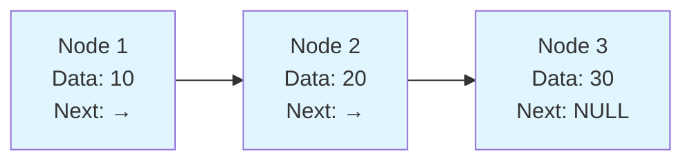
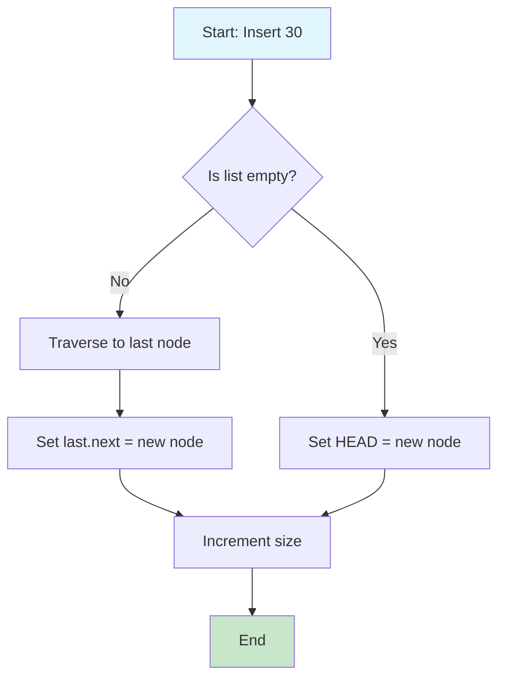
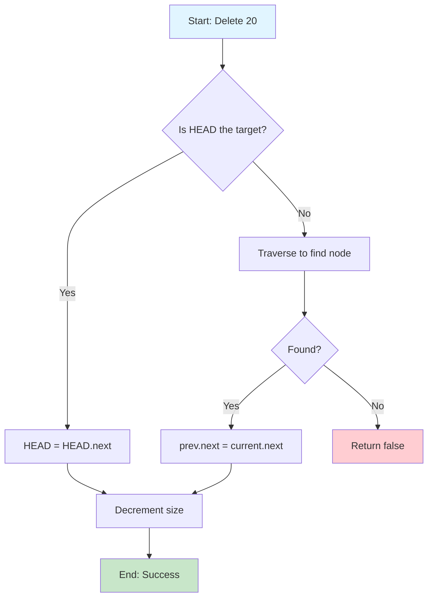
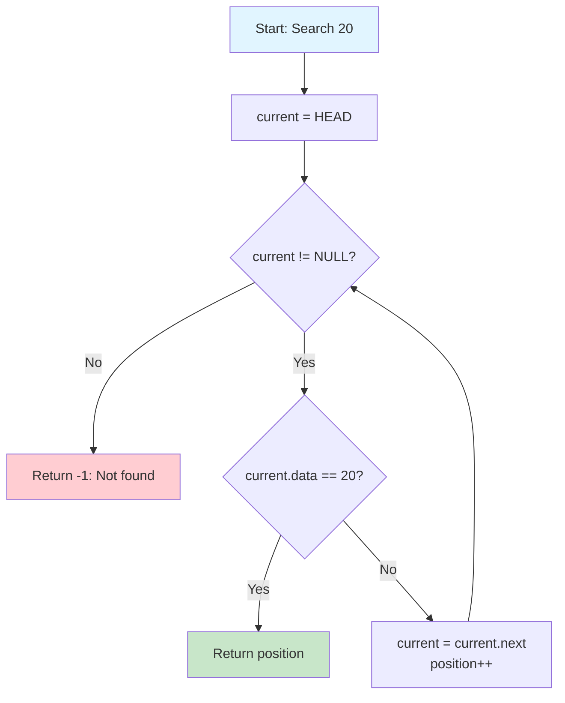
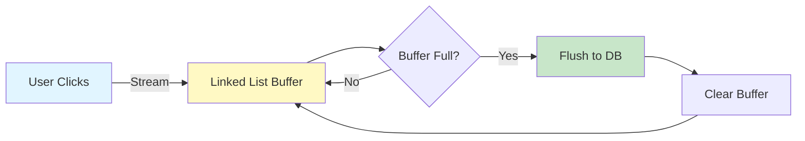
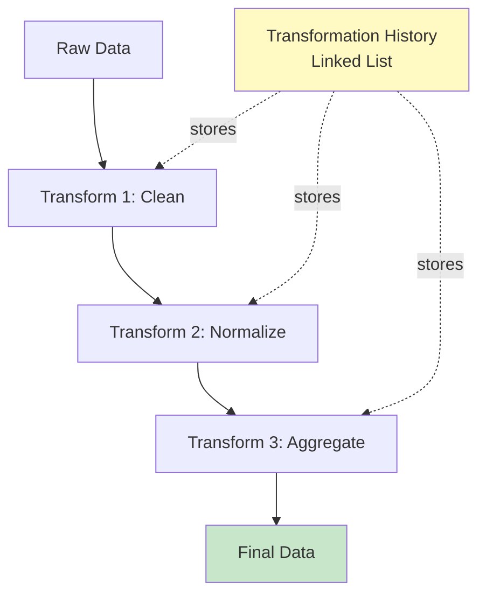

# 🔗 Linked List Visualizations & Data Engineering Guide

## 📖 Table of Contents
1. [What is a Linked List?](#what-is-a-linked-list)
2. [Visual Representation](#visual-representation)
3. [Operations Step-by-Step](#operations-step-by-step)
4. [Data Engineering Use Cases](#data-engineering-use-cases)
5. [Language Comparisons](#language-comparisons)
6. [Performance Analysis](#performance-analysis)

---

## What is a Linked List?

A **Linked List** is a linear data structure where elements (nodes) are connected via pointers/references.

### Structure
```
┌─────┬──────┐    ┌─────┬──────┐    ┌─────┬──────┐
│ 10  │  •───┼───>│ 20  │  •───┼───>│ 30  │ NULL │
└─────┴──────┘    └─────┴──────┘    └─────┴──────┘
 Data   Next       Data   Next       Data   Next
```

### Components
- **Node**: Contains `data` and `next` pointer
- **Head**: First node in the list
- **NULL**: Marks the end of the list

### Mermaid Diagram


---

## Visual Representation

### Empty List
```
HEAD: NULL
```

### Single Node
```
HEAD
  ↓
┌─────┬──────┐
│ 10  │ NULL │
└─────┴──────┘
```

### Multiple Nodes
```
HEAD
  ↓
┌─────┬──────┐    ┌─────┬──────┐    ┌─────┬──────┐    ┌─────┬──────┐
│ 10  │  •───┼───>│ 20  │  •───┼───>│ 30  │  •───┼───>│ 40  │ NULL │
└─────┴──────┘    └─────┴──────┘    └─────┴──────┘    └─────┴──────┘
```

---

## Operations Step-by-Step

### 1. Insert at End

**Initial State:**
```
HEAD → [10] → [20] → NULL
```

**Step 1: Create New Node**
```
HEAD → [10] → [20] → NULL

New Node: [30] → NULL
```

**Step 2: Traverse to End**
```
HEAD → [10] → [20] → NULL
                ↑
             current
```

**Step 3: Link New Node**
```
HEAD → [10] → [20] → [30] → NULL
```

**Flowchart:**


### 2. Delete Node

**Initial State:**
```
HEAD → [10] → [20] → [30] → NULL
```

**Delete 20:**

**Step 1: Find Previous Node**
```
HEAD → [10] → [20] → [30] → NULL
        ↑      ↑
      prev   current
```

**Step 2: Update Links**
```
HEAD → [10] ──────→ [30] → NULL

        [20]  (removed)
```

**Flowchart:**


### 3. Search for Value

**Search for 20:**
```
Step 1:  HEAD → [10] → [20] → [30] → NULL
                  ↑
                current (not found)

Step 2:  HEAD → [10] → [20] → [30] → NULL
                        ↑
                     current (FOUND!)
```

**Algorithm:**


---

## Data Engineering Use Cases

### 🎯 Use Case 1: Stream Processing Buffer

**Scenario:** Processing real-time clickstream data from a website.



**Implementation:**
```python
class ClickStreamProcessor:
    """Process click events using linked list buffer."""

    def __init__(self, batch_size=1000):
        self.buffer = SinglyLinkedList()
        self.batch_size = batch_size

    def process_click(self, user_id, page, timestamp):
        """Add click to buffer."""
        click = {
            'user_id': user_id,
            'page': page,
            'timestamp': timestamp
        }
        self.buffer.insert(click)

        # Auto-flush when batch size reached
        if len(self.buffer) >= self.batch_size:
            self.flush_to_database()

    def flush_to_database(self):
        """Write buffered clicks to database."""
        for click in self.buffer:
            db.insert('clicks', click)
        self.buffer = SinglyLinkedList()  # Clear buffer
```

**Why Linked List?**
- ✅ Dynamic size (don't know batch size in advance)
- ✅ O(1) insertion at head
- ✅ Efficient iteration for batch processing
- ✅ Memory-efficient (no pre-allocation needed)

---

### 🎯 Use Case 2: Undo/Redo in Data Transformations

**Scenario:** Track data transformation steps in ETL pipeline.



**Implementation:**
```python
class TransformationPipeline:
    """ETL pipeline with transformation history."""

    def __init__(self):
        self.history = SinglyLinkedList()
        self.current_data = None

    def apply_transform(self, transform_func, name):
        """Apply transformation and record in history."""
        # Save state before transformation
        state = {
            'name': name,
            'data_before': self.current_data.copy(),
            'timestamp': datetime.now()
        }

        # Apply transformation
        self.current_data = transform_func(self.current_data)
        state['data_after'] = self.current_data.copy()

        # Add to history
        self.history.insert(state)

    def show_history(self):
        """Show all transformations applied."""
        for i, transform in enumerate(self.history):
            print(f"{i+1}. {transform['name']} at {transform['timestamp']}")
```

**Example Usage:**
```python
pipeline = TransformationPipeline()
pipeline.current_data = load_raw_data()

# Apply transformations
pipeline.apply_transform(clean_nulls, "Remove Nulls")
pipeline.apply_transform(normalize_columns, "Normalize")
pipeline.apply_transform(aggregate_daily, "Daily Aggregation")

# View history
pipeline.show_history()
# Output:
# 1. Remove Nulls at 2024-01-15 10:30:00
# 2. Normalize at 2024-01-15 10:30:05
# 3. Daily Aggregation at 2024-01-15 10:30:12
```

---

### 🎯 Use Case 3: Queue Implementation for Job Processing

**Scenario:** Background job queue in data pipeline.

```
Producer (Add Jobs)          Consumer (Process Jobs)
       ↓                              ↓
┌──────────────────────────────────────────────┐
│  JOB QUEUE (Linked List)                     │
│                                               │
│  HEAD → [Job1] → [Job2] → [Job3] → NULL     │
│          ↑                           ↑        │
│        Dequeue                    Enqueue     │
└──────────────────────────────────────────────┘
```

**Implementation:**
```python
class DataJobQueue:
    """Job queue for data processing tasks."""

    def __init__(self):
        self.jobs = SinglyLinkedList()
        self.processing = False

    def enqueue_job(self, job_type, data, priority=0):
        """Add job to queue."""
        job = {
            'type': job_type,
            'data': data,
            'priority': priority,
            'created_at': datetime.now()
        }
        self.jobs.insert(job)
        print(f"✓ Job queued: {job_type}")

    def process_next_job(self):
        """Process next job in queue."""
        if len(self.jobs) == 0:
            print("No jobs in queue")
            return

        job = self.jobs[0]  # Get first job
        self.jobs.delete_at(0)  # Remove from queue

        # Process job
        print(f"⚙️  Processing: {job['type']}")
        self._execute_job(job)
        print(f"✓ Completed: {job['type']}")

    def _execute_job(self, job):
        """Execute the job based on type."""
        if job['type'] == 'data_import':
            import_data(job['data'])
        elif job['type'] == 'transform':
            transform_data(job['data'])
        elif job['type'] == 'export':
            export_data(job['data'])
```

**Example:**
```python
queue = DataJobQueue()

# Add jobs
queue.enqueue_job('data_import', {'source': 'api', 'table': 'users'})
queue.enqueue_job('transform', {'operation': 'clean_nulls'})
queue.enqueue_job('export', {'destination': 's3://bucket/data/'})

# Process jobs
while len(queue.jobs) > 0:
    queue.process_next_job()

# Output:
# ✓ Job queued: data_import
# ✓ Job queued: transform
# ✓ Job queued: export
# ⚙️  Processing: data_import
# ✓ Completed: data_import
# ⚙️  Processing: transform
# ✓ Completed: transform
# ⚙️  Processing: export
# ✓ Completed: export
```

---

## Language Comparisons

### Implementation Comparison

#### Python (Most Pythonic)
```python
class SinglyLinkedList:
    def __init__(self):
        self._head = None
        self._size = 0

    def insert(self, data):
        new_node = ListNode(data)
        if not self._head:
            self._head = new_node
        else:
            current = self._head
            while current.next:
                current = current.next
            current.next = new_node
        self._size += 1

    def __len__(self):  # Magic method!
        return self._size

    def __iter__(self):  # Make it iterable!
        current = self._head
        while current:
            yield current.data
            current = current.next
```

**Advantages:**
- ✅ Magic methods (`__len__`, `__iter__`)
- ✅ Type hints for IDE support
- ✅ Most readable syntax
- ✅ Perfect for rapid prototyping

**Best for:** Data analysis scripts, Jupyter notebooks, quick prototypes

---

#### Scala (Functional)
```scala
sealed trait LinkedList[+A] {
  def prepend[B >: A](elem: B): LinkedList[B] = Node(elem, this)
  def isEmpty: Boolean
}

case object Empty extends LinkedList[Nothing] {
  def isEmpty = true
}

case class Node[A](head: A, tail: LinkedList[A]) extends LinkedList[A] {
  def isEmpty = false
}
```

**Advantages:**
- ✅ Immutable by default
- ✅ Pattern matching
- ✅ Type safety
- ✅ Functional composition

**Best for:** Apache Spark pipelines, functional ETL, type-safe data processing

---

#### Java (Enterprise)
```java
public class SinglyLinkedList<T> {
    private class ListNode {
        T data;
        ListNode next;

        ListNode(T data) {
            this.data = data;
            this.next = null;
        }
    }

    private ListNode head;
    private int size;

    public void insert(T data) {
        ListNode newNode = new ListNode(data);
        if (head == null) {
            head = newNode;
        } else {
            ListNode current = head;
            while (current.next != null) {
                current = current.next;
            }
            current.next = newNode;
        }
        size++;
    }
}
```

**Advantages:**
- ✅ Strong typing
- ✅ Enterprise-grade
- ✅ Great for large systems
- ✅ Excellent IDE support

**Best for:** Production data platforms, Apache Flink/Beam, enterprise ETL

---

## Performance Analysis

### Time Complexity

| Operation | Time Complexity | Why? |
|-----------|----------------|------|
| **Insert at Head** | O(1) | Direct access to head |
| **Insert at Tail** | O(n) | Must traverse entire list |
| **Delete at Head** | O(1) | Direct access to head |
| **Delete by Value** | O(n) | May need to traverse entire list |
| **Search** | O(n) | Linear search required |
| **Access by Index** | O(n) | No random access |

### Space Complexity
- **Space per node**: O(1) - Fixed size
- **Total space**: O(n) - Linear with number of elements
- **Extra space**: O(1) - No additional structures needed

### vs Array Comparison

```
Operation          | Array  | Linked List | Winner
-------------------|--------|-------------|--------
Access by Index    | O(1)   | O(n)        | Array ✓
Insert at Start    | O(n)   | O(1)        | Linked List ✓
Insert at End      | O(1)*  | O(n)        | Array ✓
Delete at Start    | O(n)   | O(1)        | Linked List ✓
Search             | O(n)   | O(n)        | Tie
Memory Overhead    | Low    | High        | Array ✓

* Amortized O(1) for dynamic arrays
```

### When to Use Linked List in Data Engineering

✅ **Use Linked List When:**
- Frequent insertions/deletions at beginning
- Unknown data size
- Memory fragmentation is OK
- Implementing queue/stack
- Undo/redo functionality needed

❌ **Avoid Linked List When:**
- Need random access by index
- Memory overhead is critical
- Cache performance matters
- Searching frequently
- Working with fixed-size data

---

## Visual Summary

```
┌─────────────────────────────────────────────────────────────┐
│                   LINKED LIST CHEAT SHEET                    │
├─────────────────────────────────────────────────────────────┤
│                                                               │
│  Structure:  HEAD → [Data|Next] → [Data|Next] → NULL       │
│                                                               │
│  Best For:                                                    │
│   ✓ Stream processing buffers                                │
│   ✓ Undo/redo in transformations                            │
│   ✓ Job queues                                               │
│   ✓ Dynamic-size collections                                 │
│                                                               │
│  Avoid For:                                                   │
│   ✗ Random access needs                                      │
│   ✗ Binary search requirements                               │
│   ✗ Memory-constrained systems                               │
│                                                               │
│  Time Complexity:                                             │
│   Insert at Head:  O(1)  ⚡ FAST                             │
│   Insert at Tail:  O(n)  🐌 SLOW                             │
│   Search:          O(n)  🐌 SLOW                             │
│   Delete by Value: O(n)  🐌 SLOW                             │
│                                                               │
└─────────────────────────────────────────────────────────────┘
```

---

## 🚀 Practice Exercises

### Beginner
1. Implement `insert_at_beginning()`
2. Count nodes in the list
3. Find the middle element

### Intermediate
4. Reverse a linked list
5. Detect if list has a cycle
6. Merge two sorted linked lists

### Advanced
7. Implement LRU Cache using linked list
8. Flatten a multilevel linked list
9. Clone a linked list with random pointers

### Data Engineering
10. Build a log buffer with auto-flush
11. Implement transformation history tracker
12. Create a priority job queue

---

**Next:** [Algorithms Visualizations](../algorithms/fibonacci_visual.md)
