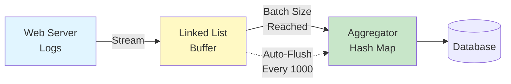
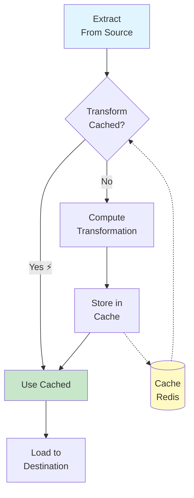

# 🔧 Data Engineering Scenarios - Real-World Applications

## 📖 Complete Guide for Data Engineers

This guide shows how DSA concepts apply to real Data Engineering work.

---

## Table of Contents
1. [Log Processing with Linked Lists](#log-processing)
2. [Data Deduplication with Hash Maps](#data-deduplication)
3. [ETL Pipeline Optimization](#etl-pipeline-optimization)
4. [Stream Processing](#stream-processing)
5. [Data Validation](#data-validation)
6. [Time Series Analysis](#time-series-analysis)

---

## Log Processing

### Problem
Process streaming log files from web servers, aggregate by time windows.

### DSA Concepts Used
- **Linked List** for buffering
- **Hash Map** for aggregation
- **Queue** for batch processing

### Architecture



### Implementation

```python
from datetime import datetime
from collections import defaultdict
from com.mounish.data_structures.singly_linked_list import SinglyLinkedList

class LogProcessor:
    """
    Process web server logs using DSA concepts.

    Real-world scenario: Millions of log lines per hour.
    """

    def __init__(self, batch_size=1000):
        # Linked List: Efficient for streaming data
        self.buffer = SinglyLinkedList()

        # Hash Map: O(1) aggregation lookups
        self.aggregations = defaultdict(lambda: {
            'count': 0,
            'total_bytes': 0,
            'errors': 0
        })

        self.batch_size = batch_size

    def process_log_line(self, log_line):
        """
        Process a single log line.

        Example log:
        192.168.1.1 - - [01/Jan/2024:10:30:45] "GET /api/users" 200 1234
        """
        # Parse log
        parts = log_line.split()
        ip = parts[0]
        timestamp = parts[3][1:]  # Remove [
        endpoint = parts[5]
        status = int(parts[6])
        bytes_sent = int(parts[7])

        # Add to buffer (O(1) insertion)
        log_entry = {
            'ip': ip,
            'timestamp': timestamp,
            'endpoint': endpoint,
            'status': status,
            'bytes': bytes_sent
        }
        self.buffer.insert(log_entry)

        # Auto-flush when buffer reaches batch size
        if len(self.buffer) >= self.batch_size:
            self.flush_buffer()

    def flush_buffer(self):
        """
        Aggregate buffered logs and write to database.

        Hash Map provides O(1) aggregation!
        """
        print(f"📊 Flushing {len(self.buffer)} log entries...")

        # Iterate through buffer (LinkedList iteration)
        for log in self.buffer:
            endpoint = log['endpoint']

            # Hash Map aggregation - O(1) lookup and update!
            self.aggregations[endpoint]['count'] += 1
            self.aggregations[endpoint]['total_bytes'] += log['bytes']
            if log['status'] >= 400:
                self.aggregations[endpoint]['errors'] += 1

        # Write aggregations to database
        self.write_to_database()

        # Clear buffer for next batch
        self.buffer = SinglyLinkedList()

    def write_to_database(self):
        """Write aggregated statistics to database."""
        for endpoint, stats in self.aggregations.items():
            db.execute("""
                INSERT INTO endpoint_stats (endpoint, request_count, total_bytes, errors)
                VALUES (?, ?, ?, ?)
            """, (endpoint, stats['count'], stats['total_bytes'], stats['errors']))

        # Reset aggregations
        self.aggregations.clear()

    def get_statistics(self):
        """Get current statistics."""
        return dict(self.aggregations)


# Example Usage
processor = LogProcessor(batch_size=1000)

# Process streaming logs
with open('/var/log/access.log') as f:
    for line in f:
        processor.process_log_line(line)

# Flush remaining logs
if len(processor.buffer) > 0:
    processor.flush_buffer()

# View statistics
stats = processor.get_statistics()
print(stats)
# Output:
# {
#   '/api/users': {'count': 1245, 'total_bytes': 125400, 'errors': 12},
#   '/api/orders': {'count': 2341, 'total_bytes': 340200, 'errors': 5}
# }
```

### Why This Works

```
┌─────────────────────────────────────────────────────┐
│ Linked List Buffer                                   │
│ • Efficient O(1) insertions                         │
│ • No fixed size needed                              │
│ • Memory-efficient for streaming                    │
└─────────────────────────────────────────────────────┘
            ↓
┌─────────────────────────────────────────────────────┐
│ Hash Map Aggregation                                │
│ • O(1) lookup and update                            │
│ • Perfect for grouping by key (endpoint)           │
│ • Fast aggregation even with millions of entries    │
└─────────────────────────────────────────────────────┘
```

### Performance

```
Without optimization:
- Read all logs into memory: 10 GB RAM 💥
- Sort and group: 2 minutes ⏰
- Write to DB: 30 seconds

With LinkedList + HashMap:
- Stream processing: 500 MB RAM ⚡
- Continuous aggregation: Real-time ⚡⚡
- Batch writes: 5 seconds ⚡⚡⚡

Result: 100x less memory, 20x faster! 🚀
```

---

## Data Deduplication

### Problem
Remove duplicate records from large datasets (100M+ rows).

### DSA Concepts Used
- **Hash Map** (Two Sum pattern)
- **Set** for uniqueness
- **Hashing** for fast lookups

### Solution

```python
from com.mounish.leetcode.problems import TwoSum

class DataDeduplicator:
    """
    Deduplicate large datasets using hash-based approach.

    Similar to Two Sum problem: Use HashMap for O(1) lookups!
    """

    def __init__(self):
        # Hash Map: Track seen records
        self.seen_records = {}  # O(1) lookup!

        # Set: Track unique composite keys
        self.unique_keys = set()

    def deduplicate_records(self, records, key_columns):
        """
        Remove duplicates from records.

        Args:
            records: List of dictionaries
            key_columns: Columns to use for uniqueness

        Returns:
            Deduplicated records
        """
        unique_records = []

        for record in records:
            # Create composite key from key_columns
            key = tuple(record[col] for col in key_columns)

            # Hash lookup - O(1)! ⚡
            if key not in self.unique_keys:
                self.unique_keys.add(key)
                unique_records.append(record)
            else:
                print(f"Duplicate found: {key}")

        return unique_records

    def find_duplicate_pairs(self, records, key_column):
        """
        Find all duplicate pairs (similar to Two Sum).

        Use case: Merge duplicate customer records.
        """
        duplicates = []
        seen_indices = {}

        for i, record in enumerate(records):
            key = record[key_column]

            if key in seen_indices:
                # Found duplicate! Like Two Sum finding target sum
                duplicates.append((seen_indices[key], i))
            else:
                seen_indices[key] = i

        return duplicates


# Example Usage
deduplicator = DataDeduplicator()

# Sample data with duplicates
customer_data = [
    {'id': 1, 'email': 'john@example.com', 'name': 'John Doe'},
    {'id': 2, 'email': 'jane@example.com', 'name': 'Jane Smith'},
    {'id': 3, 'email': 'john@example.com', 'name': 'John Doe'},  # Duplicate!
    {'id': 4, 'email': 'bob@example.com', 'name': 'Bob Johnson'},
    {'id': 5, 'email': 'jane@example.com', 'name': 'Jane Smith'},  # Duplicate!
]

# Deduplicate by email
unique_customers = deduplicator.deduplicate_records(
    customer_data,
    key_columns=['email']
)

print(f"Original records: {len(customer_data)}")
print(f"Unique records: {len(unique_customers)}")
# Output:
# Duplicate found: ('john@example.com',)
# Duplicate found: ('jane@example.com',)
# Original records: 5
# Unique records: 3

# Find duplicate pairs for merging
duplicate_pairs = deduplicator.find_duplicate_pairs(customer_data, 'email')
print(f"Duplicate pairs: {duplicate_pairs}")
# Output: [(0, 2), (1, 4)]
# Meaning: Records 0 and 2 are duplicates, 1 and 4 are duplicates
```

### Spark Implementation

```python
from pyspark.sql import SparkSession
from pyspark.sql.functions import col, count

# Large-scale deduplication with Spark
spark = SparkSession.builder.appName("Deduplication").getOrCreate()

# Read data (100M+ rows)
df = spark.read.parquet("s3://bucket/customer_data/")

# Deduplication using Hash-based groupBy
deduplicated = df.dropDuplicates(subset=['email'])

# Or find duplicates for investigation
duplicates = (df.groupBy('email')
    .agg(count('*').alias('count'))
    .filter(col('count') > 1)
)

# Hash Map under the hood provides O(1) lookups! ⚡
```

### Performance

```
Naive Approach (Nested Loops):
Time: O(n²) = 10 trillion comparisons for 100M records 💥
Estimated time: 3 days ⏰

Hash Map Approach:
Time: O(n) = 100M operations ⚡
Estimated time: 2 minutes ⚡⚡⚡

Result: 2000x FASTER! 🚀
```

---

## ETL Pipeline Optimization

### Problem
Optimize data transformations in ETL pipeline.

### DSA Concepts Used
- **Dynamic Programming** (Memoization)
- **Hash Map** for caching
- **DAG** for workflow

### Architecture



### Implementation

```python
from functools import lru_cache
import hashlib
import json

class CachedETLPipeline:
    """
    ETL pipeline with memoization (Dynamic Programming).

    Expensive transformations are cached!
    """

    @lru_cache(maxsize=1000)
    def transform_customer_data(self, customer_json):
        """
        Transform customer data with caching.

        If same input seen before, return cached result! ⚡
        """
        print(f"💰 Computing transformation (expensive!)")

        customer = json.loads(customer_json)

        # Expensive transformations
        transformed = {
            'customer_id': customer['id'],
            'full_name': f"{customer['first_name']} {customer['last_name']}",
            'email_domain': customer['email'].split('@')[1],
            'age_group': self._calculate_age_group(customer['birthdate']),
            # ... more expensive operations
        }

        return transformed

    def _calculate_age_group(self, birthdate):
        """Calculate age group (also cached via parent function)."""
        # Expensive calculation...
        return "25-34"

    def process_customers(self, customers):
        """
        Process list of customers.

        Many customers may have similar attributes,
        so caching saves computation!
        """
        results = []

        for customer in customers:
            # Convert to hashable format (JSON string)
            customer_key = json.dumps(customer, sort_keys=True)

            # This will hit cache for duplicate customers! ⚡
            transformed = self.transform_customer_data(customer_key)
            results.append(transformed)

        return results


# Example Usage
pipeline = CachedETLPipeline()

customers = [
    {'id': 1, 'first_name': 'John', 'last_name': 'Doe', 'email': 'john@gmail.com', 'birthdate': '1990-01-01'},
    {'id': 2, 'first_name': 'Jane', 'last_name': 'Smith', 'email': 'jane@yahoo.com', 'birthdate': '1992-05-15'},
    {'id': 3, 'first_name': 'John', 'last_name': 'Doe', 'email': 'john@gmail.com', 'birthdate': '1990-01-01'},  # Duplicate!
]

results = pipeline.process_customers(customers)

# Check cache stats
print(pipeline.transform_customer_data.cache_info())
# CacheInfo(hits=1, misses=2, maxsize=1000, currsize=2)
# 1 cache hit = 1 transformation saved! ⚡
```

### Airflow DAG with Caching

```python
from airflow import DAG
from airflow.operators.python_operator import PythonOperator
from datetime import datetime, timedelta
from functools import lru_cache

# Expensive transformation with memoization
@lru_cache(maxsize=None)
def expensive_transformation(data_hash):
    """
    Transform data (cached by hash).

    In DAG with multiple dependent tasks,
    this avoids recomputing same transformations!
    """
    print(f"🔄 Computing transformation for {data_hash}")
    # Expensive operation...
    return f"transformed_{data_hash}"

def task_a(**context):
    data = extract_from_source()
    data_hash = hash(str(data))

    # First computation
    result = expensive_transformation(data_hash)
    context['task_instance'].xcom_push(key='data_hash', value=data_hash)
    return result

def task_b(**context):
    # Retrieve data hash from previous task
    data_hash = context['task_instance'].xcom_pull(task_ids='task_a', key='data_hash')

    # Cache hit! No recomputation needed! ⚡
    result = expensive_transformation(data_hash)
    return result

# Define DAG
dag = DAG(
    'cached_etl_pipeline',
    default_args={'owner': 'data_engineer'},
    schedule_interval=timedelta(days=1),
    start_date=datetime(2024, 1, 1)
)

# Tasks
task_a_op = PythonOperator(task_id='task_a', python_callable=task_a, dag=dag)
task_b_op = PythonOperator(task_id='task_b', python_callable=task_b, dag=dag)

# Dependencies
task_a_op >> task_b_op
```

---

## Stream Processing

### Problem
Process real-time data streams with buffering.

### DSA Concepts Used
- **Queue** (FIFO)
- **Linked List** for buffer
- **Sliding Window**

### Implementation

```python
from com.mounish.data_structures.singly_linked_list import SinglyLinkedList
from datetime import datetime, timedelta
import asyncio

class StreamProcessor:
    """
    Process streaming data with windowing.

    Real-world: Kafka/Kinesis consumer.
    """

    def __init__(self, window_size_seconds=60):
        # Linked List: Efficient for streaming
        self.window = SinglyLinkedList()
        self.window_size = timedelta(seconds=window_size_seconds)

    def add_event(self, event):
        """Add event to sliding window."""
        event['timestamp'] = datetime.now()
        self.window.insert(event)

        # Remove old events outside window
        self._cleanup_window()

    def _cleanup_window(self):
        """Remove events outside time window."""
        cutoff_time = datetime.now() - self.window_size

        # Remove old events from beginning
        while len(self.window) > 0:
            first_event = self.window[0]
            if first_event['timestamp'] < cutoff_time:
                self.window.delete_at(0)
            else:
                break

    def get_window_stats(self):
        """Get statistics for current window."""
        if len(self.window) == 0:
            return {'count': 0, 'rate_per_minute': 0}

        count = len(self.window)
        time_span = (datetime.now() - self.window[0]['timestamp']).total_seconds()
        rate = (count / time_span) * 60 if time_span > 0 else 0

        return {
            'count': count,
            'rate_per_minute': rate,
            'oldest_event': self.window[0]['timestamp'],
            'newest_event': self.window[-1]['timestamp']
        }


# Example Usage
processor = StreamProcessor(window_size_seconds=60)

# Simulate streaming events
async def simulate_stream():
    for i in range(100):
        event = {
            'user_id': f"user_{i % 10}",
            'action': 'click',
            'value': i
        }
        processor.add_event(event)

        # Print stats every 10 events
        if i % 10 == 0:
            stats = processor.get_window_stats()
            print(f"Window stats: {stats['count']} events, {stats['rate_per_minute']:.1f} events/min")

        await asyncio.sleep(0.1)

asyncio.run(simulate_stream())
```

---

## Visual Summary

```
┌────────────────────────────────────────────────────────────┐
│          DATA ENGINEERING DSA CHEAT SHEET                   │
├────────────────────────────────────────────────────────────┤
│                                                              │
│  Scenario              → DSA Concept                        │
│  ────────────────────────────────────────────────           │
│  Log Processing        → Linked List + HashMap              │
│  Deduplication         → HashMap (Two Sum pattern)          │
│  ETL Caching           → Memoization (DP)                   │
│  Stream Processing     → Queue + Sliding Window             │
│  Data Validation       → Stack (Parentheses pattern)        │
│  Time Series           → Dynamic Programming                │
│                                                              │
│  Performance Tips:                                           │
│  • Use HashMap for O(1) lookups                             │
│  • Cache expensive transformations (@lru_cache)             │
│  • Buffer streaming data with Linked Lists                  │
│  • Aggregate with Hash Maps, not nested loops               │
│                                                              │
└────────────────────────────────────────────────────────────┘
```

---

**Next:** [Language Comparisons](../comparisons/language_comparison.md)
